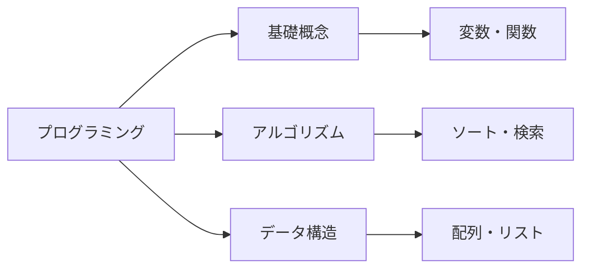

# 🐧 プログラミング勉強中 🐧

## こんにちは！プログラミングの勉強を頑張っています！

<div align="center">

```css
@keyframes waddle {
  0%, 100% { transform: translateX(0px) rotate(0deg); }
  25% { transform: translateX(5px) rotate(2deg); }
  75% { transform: translateX(-5px) rotate(-2deg); }
}

@keyframes bounce {
  0%, 100% { transform: translateY(0px); }
  50% { transform: translateY(-10px); }
}

@keyframes wave {
  0%, 100% { transform: rotate(0deg); }
  50% { transform: rotate(20deg); }
}
```

<div style="font-family: monospace; font-size: 20px; text-align: center;">

```
    🐧
   /   \
  ( o o )
  (  V  )
 /--m-m--
```

</div>

<div style="animation: waddle 2s ease-in-out infinite; display: inline-block;">

```
    🐧
   /   \
  ( ^ ^ )
  (  V  )
 /--m-m--
```

</div>

<div style="animation: bounce 1.5s ease-in-out infinite; display: inline-block;">

```
    🐧
   /   \
  ( o o )
  (  V  )
 /--m-m--
```

</div>

<div style="animation: wave 1s ease-in-out infinite; display: inline-block;">

```
    🐧
   /   \
  ( o o )
  (  V  )
 /--m-m--
```

</div>

</div>

## 🎯 現在の目標

- [ ] プログラミング基礎をマスター
- [ ] 新しい言語を学習
- [ ] プロジェクトを作成
- [ ] コミュニティに参加

## 💻 学習中の技術



## 🐧 ペンギンファクト

> ペンギンは南半球に生息する海鳥で、空を飛ぶことはできませんが、水中では素晴らしい泳ぎ手です！
> プログラミングも同じで、最初は難しいかもしれませんが、練習を重ねることで必ず上達します！

## 📚 おすすめの学習リソース

- **オンライン学習プラットフォーム**
  - Codecademy
  - freeCodeCamp
  - Udemy
  - Coursera

- **実践的な学習**
  - GitHub
  - Stack Overflow
  - Qiita（日本語）

## 🎉 モチベーション

<div align="center">

```
今日も一日、プログラミング頑張ろう！
    🐧  →  💻  →  🚀
```

</div>

---

<div align="center">

**Keep coding, keep learning! 🐧✨**

</div>
